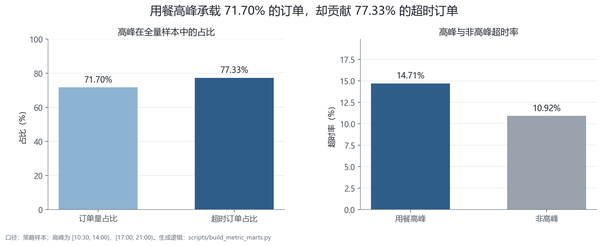
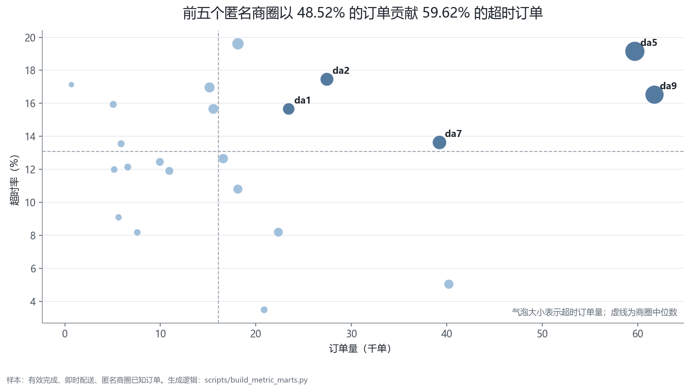
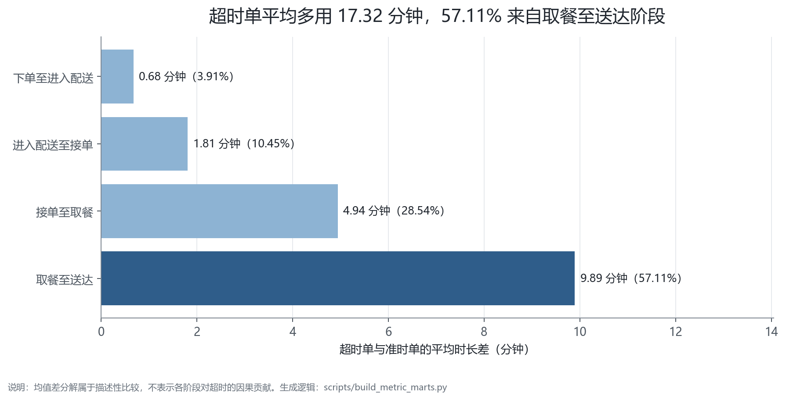
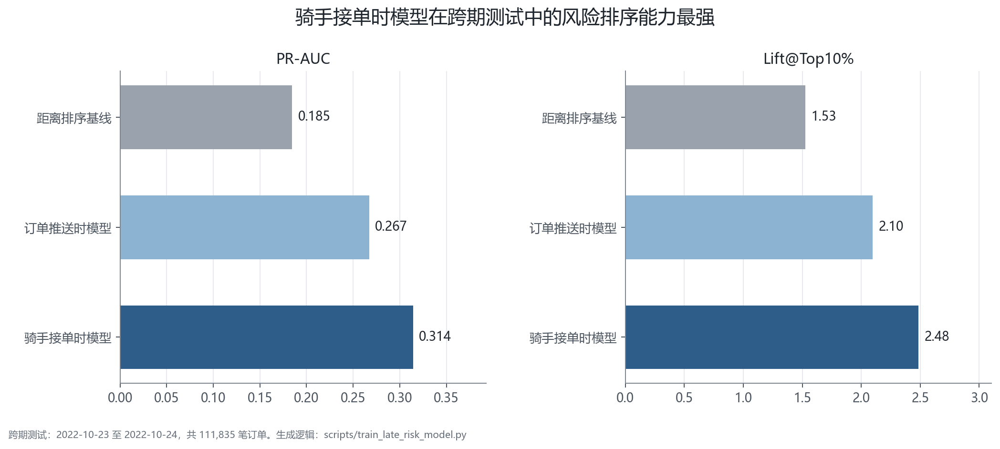
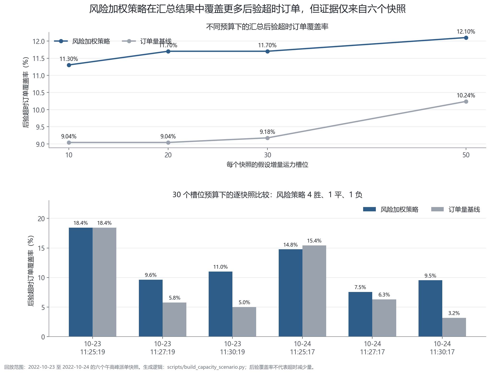

# 美团外卖订单超时分析与高峰期骑手运力配置

## 1. 管理摘要

本报告基于美团官方公开即时配送研究数据开展离线经营分析。观察期为 2022-10-17 至 2022-10-24，原始运单表包含 654,343 条派单尝试记录，并识别出 568,546 笔唯一成功运单对应订单；主要经营诊断使用 436,062 笔“有效完成、即时配送、商圈已知”的订单。

核心发现如下：

1. 策略样本超时率为 13.63%。午晚高峰承载 71.70% 的订单，却贡献 77.33% 的超时订单；高峰超时率 14.71%，高于非高峰的 10.92%。超时订单平均超时 4.60 分钟，P90 为 9.17 分钟。
2. 超时订单集中于少数匿名商圈。da5、da9、da7、da2、da1 五个商圈以 48.52% 的订单贡献约 59.62% 的超时订单，因此增量运力不宜按照全城订单规模等比例配置。
3. 超时单相对准时单平均多用 17.32 分钟，其中取餐至送达阶段贡献 9.89 分钟，接单至取餐阶段贡献 4.94 分钟。该结果是描述性时长差分解，不是因果归因，也不能把接单至取餐全部解释成商家出餐慢。
4. 骑手接单时超时风险模型在 2022-10-23 至 2022-10-24 的跨期测试集上取得 PR-AUC 0.314、Lift@Top10% 2.48，高于仅按距离排序基线的 1.53。模型可用于风险队列分层，但不能据此推断调度干预的因果效果。
5. 在六个午高峰派单快照、每个快照 30 个假设增量运力槽位的回放中，风险加权策略汇总覆盖 11.82% 的预计超时风险和 11.70% 的后验超时订单，供需量基线分别为 9.01% 和 9.18%；逐快照比较为 4 胜、1 平、1 负。结果说明风险加权策略在该样本中提高了高风险网格的总体识别集中度，但稳定性证据有限，且不构成增量收益估计。

## 2. 业务问题与决策对象

核心决策问题是：当高峰期临时运力受限时，如何确定商圈、时段及订单层级的运营干预优先级。

对应三个决策层级：

- 事前规划：按历史商圈×时段风险制定高峰预备运力。
- 实时监控：订单进入配送后，用早期可用特征形成风险队列。
- 接单后处置：当派单等待已经发生时，更新风险等级，供催取、转派或异常跟进使用。

主指标为订单超时率；同时使用超时订单量衡量业务规模，使用履约阶段时长定位问题，并以风险覆盖率、集中度和局部候选骑手数约束运力方案。

## 3. 数据建模与质量控制

### 3.1 粒度

- 原始运单表一行代表一次运单尝试，不等于一个订单。
- 57,770 个订单存在多次运单尝试，单个订单最多 17 次。
- 每个订单只有一个最终接单运单，因此订单宽表保留最终履约链路，同时聚合尝试次数和拒绝次数。
- 派单订单表和候选骑手表是同一决策时点的两组候选集合，不是订单—骑手匹配关系；若仅按时间连接，会错误膨胀至 41,171,726 行。

### 3.2 缺失与异常

原始表面上没有空值，但多个时间字段用 0 表示事件尚未发生。分析时将零值按业务语义处理，而不是当作 1970 年时间戳。568,546 笔唯一成功运单对应订单中，1 笔缺少实际送达时间且未进入完整骑手波次，因此不进入有效完成结果口径；其余 568,545 笔具有有效完成链路。

### 3.3 样本口径

经营策略样本限定为：

- 完成时间链路有效；
- 即时单而非预订单；
- 匿名商圈 ID 已知。

该口径有利于分析可干预的即时履约问题，但不能外推至全部预订单或其他城市时期。

## 4. 履约诊断

### 4.1 时间集中

午高峰定义为 [10:30, 14:00)，晚高峰定义为 [17:00, 21:00)，时间基于订单进入配送系统的时点。8 天的单日超时率介于 12.12% 和 14.91% 之间。由于观察窗只有 8 天，不能据此建立稳定的周内规律或季节性结论。

59,456 笔超时订单的平均超时为 4.60 分钟，P50 为 3.17 分钟，P90 为 9.17 分钟；其中 91.14% 的超时订单不超过 10 分钟。该分布说明问题以轻度超时为主，运营评估应同时关注超时订单规模与严重超时长尾。

图 1　用餐高峰的订单规模、超时订单贡献及超时率对比。

### 4.2 商圈集中

da5 超时率 19.15%，贡献 11,433 个超时订单；da9 超时率 16.52%，贡献 10,204 个。前五个商圈承载 48.52% 的订单，却贡献 59.62% 的超时订单，合计超时率为 16.75%，其余商圈为 10.70%。商圈排序同时看超时量和超时率，避免只追逐小样本高比例区域。

图 2　商圈优先级同时考虑业务规模、风险水平和超时订单量。

### 4.3 阶段分解

超时单与准时单的平均时长差为 17.32 分钟：

| 阶段 | 平均差值（分钟） | 差值占比 |
|---|---:|---:|
| 下单至进入配送 | 0.68 | 3.91% |
| 进入配送至接单 | 1.81 | 10.45% |
| 接单至取餐 | 4.94 | 28.54% |
| 取餐至送达 | 9.89 | 57.11% |

配送距离越远、运单尝试次数越多，超时率越高；但这仍是相关关系，不能直接当成可干预效果。

图 3　超时单与准时单的履约阶段平均时长差分解。

## 5. 超时风险识别

模型采用按日期的跨期留出方案，而非随机切分：10 月 17–21 日用于候选模型训练，10 月 22 日用于验证，最终使用 10 月 17–22 日重新训练，并在 10 月 23–24 日进行独立测试。

- 订单推送时模型仅使用该决策时点已经可得的特征，测试 Lift@Top10% 为 2.10。
- 接单时模型增加已实现的派单等待等特征，测试 Lift@Top10% 为 2.48。
- 仅距离排序的基线 Lift@Top10% 为 1.53。

骑手接单时模型具备更充分的过程信息，但对应更晚的运营处置时点；订单推送时模型识别能力相对较弱，但更适合事前预警。模型选择应服从业务决策时点，而不能仅依据单一离线指标。

图 4　不同决策时点模型与距离排序基线的跨期测试表现。

## 6. 运力配置回放

将脱敏空间划分为约 500m × 400m 网格，并统计每个派单快照内的待分配订单、预计超时需求和 2km 范围内候选骑手。风险加权策略依据“预计超时需求 ÷（局部候选骑手 + 已分配槽位 + 1）”计算边际优先级，并设置单网格配置集中度约束。

其中，预计超时需求由订单风险概率加总得到。由于模型未经过独立的长期概率校准，该指标仅作为相对风险质量用于网格排序，不解释为超时订单绝对预测值。

回放仅覆盖 2022-10-23 和 2022-10-24 的六个午高峰快照及 3,854 个待分配订单。增量运力槽位是抽象资源预算，不等同于骑手工时或真实排班成本。同一候选骑手可能出现在多个重叠的 2km 邻域中，因此局部供给指标不可跨网格直接求和。

30 个槽位预算下，风险加权策略在六个快照中取得 4 胜、1 平、1 负。汇总优势主要来自部分快照，说明当前结果可支持进入小流量试点，但不足以证明策略在不同日期和峰值条件下稳定占优。

图 5　不同预算下的汇总覆盖率及 30 个槽位预算下的逐快照比较。

建议先以小规模试点验证：风险策略是否比订单量策略更好地覆盖高风险订单，同时监控接单时长、空驶距离、骑手利用率、取消率和成本。只有随机化或准实验设计才能估算真实增量收益。

## 7. 运营建议

1. 将高峰运力预备从全城统一增配改为“商圈×30 分钟”分层，优先关注高超时量且高超时率的商圈。
2. 建立两段式预警：订单进入配送时做早期风险排序，接单后用派单摩擦更新风险。
3. 对接单至取餐和取餐至送达分别拆因；补充到店、出餐、等待、交通和天气字段后再决定是商家治理还是骑手调度。
4. 试点采用风险加权策略与供需量基线的对照，预先定义主指标和护栏指标，避免将后验覆盖率表述为线上增量收益。

## 8. 结论边界

- 数据只有 8 天，适合短周期履约诊断和跨期留出验证，不适合长期需求预测。
- 商圈已匿名，无法给出真实地名和本地运营背景。
- 缺少天气、交通、商家出餐完成、骑手工作状态和真实成本。
- 运力策略是离线情景回放，不是因果实验，也没有真实上线。

## 9. 数据来源与复现

- 数据来源：[Meituan-INFORMS-TSL Research Challenge 官方仓库](https://github.com/meituan/Meituan-INFORMS-TSL-Research-Challenge)。
- 数据许可：CC BY-NC 4.0；原始数据及其衍生作品仅限非商业用途，仓库不分发原始数据。
- 复现方式：按照项目根目录 `README.md` 配置环境并执行 `python scripts/run_pipeline.py`。

本研究由美团提供数据支持。
